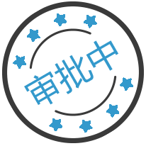
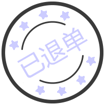
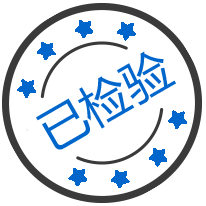
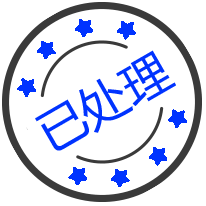
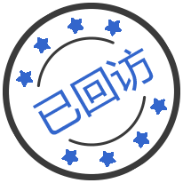
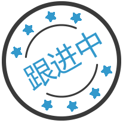
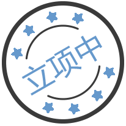
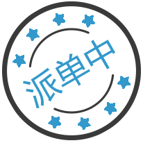
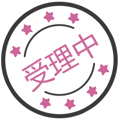
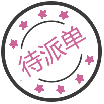

## 图标
| 路径                                              | 图标                               |
| ------------------------------------------------- | ---------------------------------- |
| assets\images\state\state_acceptanceof.png        |         |
| assets\images\state\state_already_passed.png      |       |
| assets\images\state\state_approval.png            |             |
| assets\images\state\state_back.png                |                 |
| assets\images\state\state_cancel.png              |               |
| assets\images\state\state_doing.png               |                |
| assets\images\state\state_end.png                 |                  |
| assets\images\state\state_finish_check.png        |         |
| assets\images\state\state_finish_handle.png       |        |
| assets\images\state\state_finish_return.png       |        |
| assets\images\state\state_finish.png              |               |
| assets\images\state\state_following.png           |            |
| assets\images\state\state_handling.png            |             |
| assets\images\state\state_not_upproject.png       |        |
| assets\images\state\state_nothandle.png           |            |
| assets\images\state\state_pay_finish.png          |           |
| assets\images\state\state_setupproject.png        |         |
| assets\images\state\state_singling.png            |             |
| assets\images\state\state_unacceptance.png        |         |
| assets\images\state\state_uncheck.png             |              |
| assets\images\state\state_under_consideration.png |  |
| assets\images\state\state_unhandle.png            |             |
| assets\images\state\state_unpass.png              |               |
| assets\images\state\state_unreturn.png            |             |
| assets\images\state\state_unsend.png              |               |
